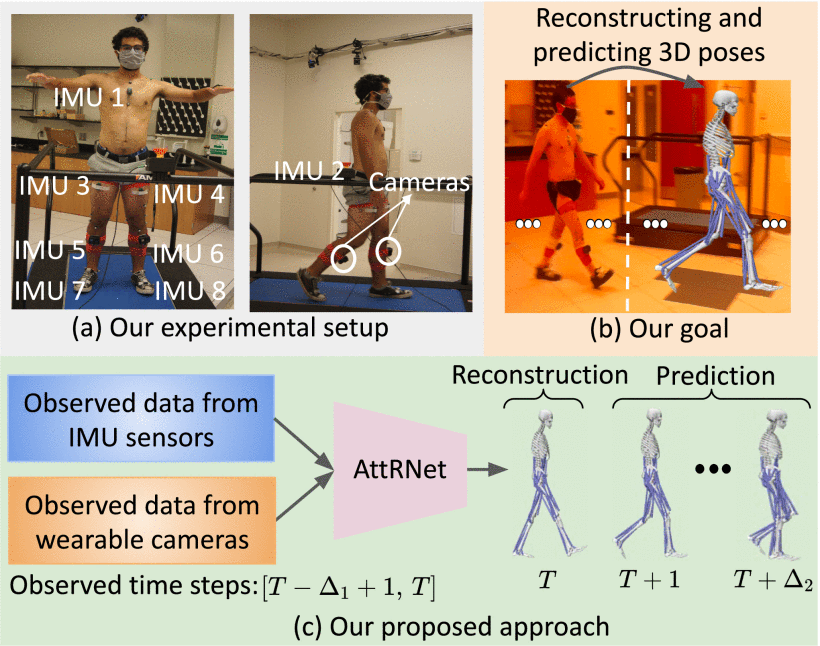

# Wearable-Motion-Capture (Under Construction)

## Summary

Reconstructing and predicting 3D human walking poses in unconstrained environments has significant potential for use in health monitoring systems, especially for individuals with movement disabilities. By assessing progression after treatments and providing data for assistive device controls, these systems can aid patient care. Current pose estimation algorithms rely on motion capture systems that gather data from IMU sensors and third-person cameras. However, third-person views are often impractical for outpatients.

  

This paper proposes a wearable motion capture approach that reconstructs and predicts 3D human poses using only wearable IMU sensors and wearable cameras, enabling clinicians to monitor patients remotely. The key contribution is a novel **Attention-Oriented Recurrent Neural Network (AttRNet)**, which includes:
- A sensor-wise attention-oriented recurrent encoder
- A reconstruction module
- A dynamic temporal attention-oriented recurrent decoder

This network reconstructs 3D human poses over time and predicts future poses at subsequent time steps. To validate the approach, a new **WearableMotionCapture** dataset was created, combining IMU and camera data with musculoskeletal joint angle ground truth. The proposed AttRNet achieves high accuracy on the lower-limb WearableMotionCapture dataset and outperforms state-of-the-art methods on two public datasets: **DIP-IMU** and **TotalCapture**.

# Demo Videos

Walking on Treadmill

Walking on Stair

Walking on Slope

Walking on Ground and Avoiding Obstacles

